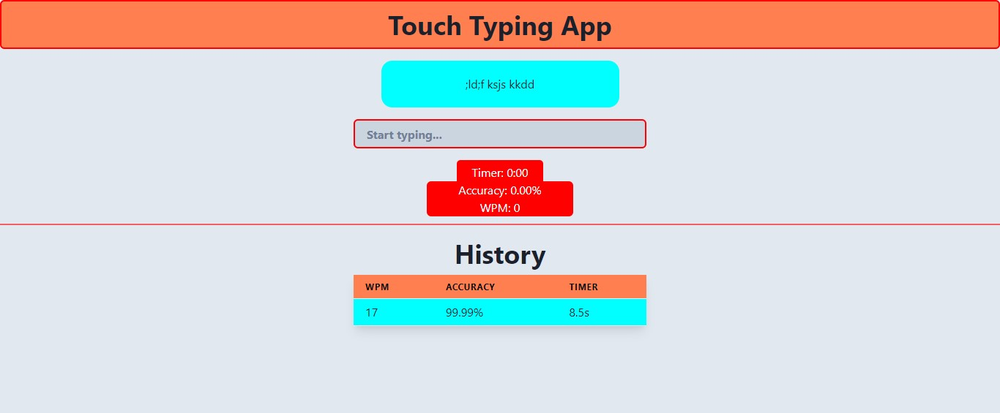

# Touch Typing App

This is a React-based Touch Typing App that allows users to practice their typing skills. The app provides a random text field for the user to type and calculates their typing speed (WPM) and accuracy. It also keeps track of the typing history, showing the user's previous performance.

# Deployed link : [https://chabbi-typing-test.netlify.app]

## Features

- Random text generation for typing practice
- Calculation of typing speed (WPM) and accuracy
- History tracking of past typing performances
- User interface with Chakra UI components
- Real-time color indication of correct and incorrect typing

## Installation

1. Clone the repository:

```shell
git clone https://github.com/your/repo.git

```

2. Navigate to the project directory:

```shell
cd typing-app
```
3. Install the dependencies:

```shell
npm install

```

4. Start the development server:

```shell
npm start
```

5. Open your browser and visit http://localhost:3000 to access the app.

# Output




# Usage
1. The app displays a random text in a designated text field.
2. Start typing the displayed text in the input box.
3. As you type, the characters in the input box will change color:
   * Correctly typed characters will appear in green.
   * Incorrectly typed characters will appear in red.
4. Once you have typed the entire text correctly, the app will reset and generate a new random text for further practice.
5. Your typing speed (WPM) and accuracy percentage will be displayed below the input box.
6. The typing history table shows your past performances, including WPM, accuracy, and elapsed time.

# Contributing
Contributions are welcome! If you find any issues or have suggestions for improvements, feel free to open an issue or submit a pull request.

